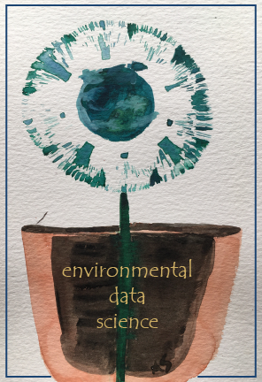

# Appendix B:  R Markdown and Bookdown {-}

This book is built using R Markdown and bookdown methods, and published at http://bookdown.org. There are some great resources on both of these at @RMarkdown and @Bookdown, but I thought it might be useful to provide some things I've discovered.

## R Markdown {-}

Markdown isn't new and isn't at all restricted to R. It's the basis for Jupyter Notebooks, which I tend to use for Python but also works with R (the "py" in Jupyter is for Python and the "r" is for R); but I think R Markdown is better developed within RStudio, which provides more of an all-in-one *integrated development environment* (IDE). 

For most users, what's covered in the cheat sheet, which should be at  https://www.rstudio.com/wp-content/uploads/2015/02/rmarkdown-cheatsheet.pdf is all you need to be able to format nice R Markdown documents, but the more thorough treatment at @RMarkdown is a good resource for going further.


## Bookdown {-}

While you can build a nice looking document in R Markdown, there are some other things that are useful for building a larger book out of it, like handling chapters and references, so you'll want to review @Bookdown to learn more. Some notes on building a book at github and bookdown.org:

- The book is built in RStudio and all Markdown and other files hosted in a GitHub repository. You'll need to learn more about that.
- Normally, html is the output format (and a variation on this is gitbook). To also create pdf you need to also specify it in the `_output.yml` file like I've done for this book:
```
bookdown::gitbook:
  css: style.css
  config:
    toc:
      before: |
        <li><a href="./">Environmental Data Science</a></li>
      after: |
        <li><a href="https://github.com/rstudio/bookdown" target="blank">Published with bookdown</a></li>
    book_filename: "envdatasci"
  toc_depth: 4
bookdown::pdf_book:
  keep_tex: TRUE
```
  - To create pdf however you need latex, so install.packages("tinytex"), then in the project:  tinytex::install_tinytex() to create the requisite files. See https://yihui.org/tinytex/
  - Use the Build menu in RStudio to specify whether you want to build which type you've specified in the `_output.yml` file.  Since building a long book like this one can take a long time (about 35 minutes for both html and pdf for this book), I sometimes just build the HTML version, then build the pdf separately if it works, and since most people will use the HTML version I update that more frequently.
  - Note that pdfs don't include interactive maps except as a static rendering.

- It's useful to list all of your chapters in order with the `_bookdown.yml` file. For example this book includes the following in that file.
```
rmd_files: ["index.Rmd", "introduction.Rmd", "abstraction.Rmd", "visualization.Rmd", "transformation.Rmd",
            "spatialDataMaps.Rmd", "spatialAnalysis.Rmd", "spatialRaster.Rmd",
            "statistics.Rmd", "modeling.Rmd", "ImageClassification.Rmd",
            "TimeSeries.Rmd",  "communication.Rmd",
            "AppendixPackage.Rmd", "AppendixRMarkdownBookdown.Rmd", "references.Rmd"]
```
- Learn how to organize the book with chapters set aside by `# ` in markdown then subheadings at various levels using `## `,, `### `, etc., and don't forget the space after the last hash. 
- The automatic numbering of chapters and subheadings is useful, but if you want a section to not use numbering, like this appendix, including `{-}` at the end of the every section header line.
- Creating sections, like **Spatial**, is done by including `(PART) before the section name, like the following, which starts off the section with this special heading followed by the first chapter:
```
# (PART) Spatial {-}

# Spatial Data and Maps

```
Note that the section is excluded from the automatic numbering with `{-}`. 

I guess I could have included some text to introduce the section but the above works to include the section name in the table of contents.

 
### Display options in code chunks {-}

The display options for code chunk headers {r ...} are very important to figure out in order to avoid unwanted messages in the book.  Each option is separated by a comma. See https://www.rstudio.com/wp-content/uploads/2015/02/rmarkdown-cheatsheet.pdf for a list of these options. I've found that some of what's documented at https://yihui.org/knitr/options/#code-evaluation isn't quite right, so here's what I've observed: `echo=TRUE` won't display the code if `include=FALSE` is set, though the above source suggests that the `include` option only refers to chunk output.

Display options (useful for exercises):

1. no code no outputs  : `include=F` [normal for exercises in book]
2. code no outputs     : `include=T,fig.show="hide",results=F` (`include=T` is default) results="markup" is default (same as T?)
3. code and outputs    : `include=T,echo=T,fig.show=T,results=T`  (return to defaults)
4. no code or no eval  : `include=F,eval=F`       

Exceptions like showing figure "goals" under all of these conditions can only be done by using screen shots, then brought in with something like this code and figure reference (Figure \@ref(fig:TransectBuffersGoal))

```{r TransectBuffersGoal,include=T,eval=T,echo=F,out.width='50%',fig.align="center",fig.cap="Transect Buffers (goal)"}
knitr::include_graphics(here::here("img","goal_spanlTransectBuffers.png"))
```

Note that https://yihui.org/knitr/options/ says that results="asis" should work, but this created errors for me, very frustrating since they only show when it's a LaTeX error at the end of all of the R markdown compilation.

**Warnings and messages**
Turning off warnings and messages is so important in a book that I use knitr::opts_chunk$set to set these as defaults at the top of each chapter .Rmd. 

```{r echo=F}
knitr::opts_chunk$set(echo=T, warning=F, message=F, fig.align='center', out.width="75%")
```

However some things that seem like messages are actually *results*, for instance:

`st_read` will create unwanted messages that are actually results, so you can either put it in a code chunk that isn't displayed at all with `include=F` or probably better use `results = "hide"`. For instance, the following code is in a code chunk that has three options `{r warning=F, results="hide", message=F}` to avoid printing quite a lot of unwanted stuff:

```{r warning=F, results="hide", message=F}
library(sf); library(igisci)
places <- st_read(ex("sierra/CA_places.shp"))
```

### Numbered figures with text citations

In the text, cite the figure with Figure \@ref(fig:visSimpleBarGraph) or (Figure \@ref(fig:visSimpleBarGraph)).  The `fig:` is key to that name, followed by the chunk label.

```{r visSimpleBarGraph, fig.cap="Simple bar graph of meadow vegetation samples"}
ggplot(XSptsNDVI, aes(vegetation)) + 
  geom_bar()
```

### LaTeX / pdf book notes
As Yihui Xie notes in https://bookdown.org/yihui/bookdown/ you should probably only create an html document, since there are many formatting issues you'll need to deal with for pdf.  There are a lot of challenges in going to pdf, because the process is that:

- RStudio creates a LaTeX .tex document
- Your LaTeX interpreter (probably tinytex, as recommended by Xihui) compiles the .tex to pdf. 

So to debug issues, you're dealing with both R/RMarkdown & knitr things, you're also dealing with LaTeX things, and if you're like me, you don't really want to learn all about LaTeX; you just want RStudio to take care of it.

The YAML files _output.yml, _bookdown.yml, and the index.Rmd need to be set up right, and it's difficult to know what goes in which.  Here are some important things I've discovered:

#### _output.yml

nly has outputs.  See my example:

```
bookdown::gitbook:
  css: style.css
  config:
    toc:
      collapse: none
      before: |
        <li></li>
      after: |
        <li><a href="https://github.com/rstudio/bookdown" target="blank">Published with bookdown</a></li>
    book_filename: "envdatasci"
  toc_depth: 4
bookdown::pdf_book:
  includes:
    in_header: latex/preamble.tex
    before_body: latex/before_body.tex
    after_body: latex/after_body.tex
  keep_tex: true
  dev: "cairo_pdf"
  latex_engine: xelatex
  template: null
  pandoc_args: --top-level-division=chapter
  toc_depth: 3
  toc_unnumbered: false
  toc_appendix: true
  quote_footer: ["\\VA{", "}{}"]
  highlight_bw: true
```
- note the latex_engine: xelatex -- that required specifying the xelatex engine, which you can set in RStudio Build/Configure Build Tools in the Sweave section of the Project Options window that will display and choosing XeLaTeX. For CRC, I needed the features this has, but didn't realize it until after a *lot* of trial & error.

#### index.Rmd

These settings are a higher level than what's in _output.yml, though you could put the things in that file here under an `output:` line. See examples in https://bookdown.org/yihui/bookdown/.

```
---
title: "Introduction to Environmental Data Science"
author: "Jerry Davis, SFSU Institute for Geographic Information Science"
date: "`r Sys.Date()`"
documentclass: krantz
classoption: krantz2
bibliography: [book.bib]
biblio-style: apalike
link-citations: yes
colorlinks: yes
lot: no
lof: yes
site: bookdown::bookdown_site
description: Background, methods and exercises for using R for environmental data
  science.  The focus is on applying the R language and various libraries for data
  abstraction, transformation, data analysis, spatial data/mapping, statistical modeling,
  and time series, applied to environmental research. Applies exploratory data analysis
  methods and tidyverse approaches in R, and includes contributed chapters presenting
  research applications, with associated data and code packages.
github-repo: iGISc/EnvDataSci
graphics: yes
geometry: margin=0.75in
---
```
This includes krantz to specify the krantz.cls file provided by CRC Press, the publisher I'm going with for this book, and why I'm going to the major trouble of getting the LaTeX working. The classoption:krantz2 ends up creating the following in the .tex file, which is needed by the publisher to get the page size right for CRC. The krantz.cls file used was edited for me by the original programmer who wrote it. The classoption: krantz2 then produces the following in the .tex document. 

```
\documentclass[
  krantz2]{krantz}
```

#### _bookdown.yml

The main thing I use this for is the list of chapters, which is nice to specify instead of letting the RStudio figure out the chapters based on their names by using numbers like 01_introduction, etc., and I can comment out parts -- so I've set them up one line at a time to make it easy to use Ctrl-Sh-C to toggle commenting.
```
book_filename: "EnvDataSci"
clean: [packages.bib, bookdown.bbl]
delete_merged_file: true
rmd_files: ["index.Rmd",
            "introduction.Rmd",
            "abstraction.Rmd",
            "visualization.Rmd",
            "transformation.Rmd",
            "spatialDataMaps.Rmd",
            "spatialAnalysis.Rmd",
            "spatialRaster.Rmd",
            "spatialInterpolation.Rmd",
            "statistics.Rmd",
            "modeling.Rmd",
            "ImageryAnalysisClassification.Rmd",
            "TimeSeries.Rmd",
            "communication.Rmd",
            "references.Rmd"]
language:
  label:
    fig: "FIGURE "
    tab: "TABLE "
  ui:
    edit: "Edit"
    chapter_name: "Chapter "
```


#### Figure labels

- Can't have underscores and other special characters like `&` and `_`.
- Subscripts and superscripts can be confusing between html and LaTeX.  See https://www.math.mcgill.ca/yyang/regression/RMarkdown/example.html .using ~ and _ like CO~2~ and X_2_ might work in Rmarkdown and html, but not in LaTeX/pdf.

https://www.rstudio.com/wp-content/uploads/2015/02/rmarkdown-cheatsheet.pdf


